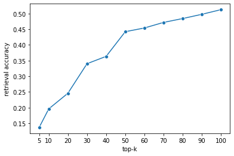

<a href="https://github.com/psf/black"></a>


## KorDPR

한국어 위키로 인덱스를 만들고 KorQuAD 데이터셋을 활용해 학습할 수 있도록 하는 dense passage retrieval(DPR) 소스코드 입니다. 

### 모델 설명

DPR 모델은 두 BERT 모델을 활용하여 query와 passage를 각각 인코딩하고 cls 토큰의 dot product를 통해 유사도를 측정합니다. 학습 데이터는 한국어 위키 기반의 데이터인 KorQuAD 1.0을 사용하였고 실제 ground truth passage를 찾기 위해서는 수작업이 필요하므로 DPR 논문에서 제안한 바와 같이 distant supervision을 사용하였습니다. query에 해당되는 정답 span을 추론할 수 있는 passage가 gold passage라고 한다면, 단순히 문제가 출제된 article 내에서 정답 span이 들어있는 passage를 silver passage라고 할 수 있습니다. 미리 구축해 둔(100단어 단위로 잘린) passage 내에서 데이터셋의 각 query에 맞는 silver passage를 매칭하여 정답으로 활용하였습니다. 학습 방법은 DPR 논문에서 제안한 바와 같이 in-batch negative를 활용한 nll loss로 학습하였습니다. 이 방식은 batch 내에 동일한 정답 passage를 갖는 query가 없다면 랜덤하게 negative sample을 뽑는 대신 batch 내에서 outer product를 통해 쉽게 negative sample을 확보하는 방법입니다. 이 경우 outer product를 한 B x B 개의 logit 값들의 주대각선이 최대화 되도록 학습할 수 있습니다.

현재 passage나 query 모델로는 skt/kobert-base-v1 모델을 사용하고 있습니다.  


### How To Run

1. torch 및 python 환경은 `nvcr.io/nvidia/pytorch:21.11-py3` 도커 이미지를 사용하시는 것을 권장합니다.
소스코드는 torch 1.10.2 버전 및 python 3.8.12 버전에서 테스트하였습니다.

```
docker pull nvcr.io/nvidia/pytorch:21.11-py3
docker run -it --gpus=all nvcr.io/nvidia/pytorch:21.11-py3 /bin/bash
cd /workspace
git clone https://github.com/TmaxEdu/KorDPR.git
cd KorDPR
```

2. 가상환경을 생성합니다.

```
conda env create --file environment.yml
```

3. 한국어 wiki를 파싱합니다. 많은 kowiki 덤프 파일이 있는데 `kowiki-20220120-pages-articles.xml`을 사용하시는 것을 권장합니다. reference의 링크에서 다운받아주세요.

```
wikiextractor <xml_file_path> --no-templates
```

4. 한국어 wiki를 passage 단위로 쪼개는 전처리를 진행합니다.

```
python chunk_data.py 
```

5. korquad 데이터를 활용하여 retriever를 학습합니다. 학습을 위한 데이터에는 `KorQuAD 1.0`을 사용하였습니다. reference의 링크에서 다운받아주세요.

```
python trainer.py
```

6. 학습된 모델을 활용하여 passage index를 구축합니다.
```
python index_runner.py
```

7. index와 모델을 활용하여 custom query에 대한 retrieval을 수행합니다. 
```
python retriever.py -q "중국의 천안문 사태가 일어난 년도는?" -k 20
```
```
passage : [CLS] 구정 대공세[SEP], 그에 더해 한 베트콩 장교가 남베트남의 경찰청장에 의해 즉결 총살되는 사진이 급격히 확산되면서 더욱더 심각해졌다.[SEP], sim : 71.62007141113281
passage : [CLS] 1976년 톈안먼 사건[SEP] 탄압되었으며, 덩샤오핑에게 책임을 물어, 4월 7일 그의 모든 직무를 박탈함으로써 실각시켰다. 반면, 이 사건 뒤 화궈펑은 정식으로 총리의 자리에 올랐다. 평가. 중화인민공화국은 그 해 9월 마오쩌둥이 사망하고, 10월에는 ‘베이징 정변’으로 사인방이 체포되는 등 격동의 시기를 체험하였다. 이 사건은 1976년 당시 화궈펑, sim : 70.32980346679688
passage : [CLS] 중국산[SEP]hinafree, 물건을 만들 때 중국산을 재료로 넣지 않는 행위)라는 신조어가 나올 정도이다. 중국이 하루빨리 시정하지 않을 경우, 중국 경제에 큰 타격을 줄 원인으로 자리매김하리란 것이 경제학자 및 정치인, 정치학자들의 분석이다. 역대 해외 주요 사건, 사고들. 다음은 세계 각지에서 발생한 중국산 물품 관련 사건, 사고들의 목록이다.[SEP], sim : 70.20785522460938
passage : [CLS] 청불 전쟁[SEP] 양쪽 모두 사소한 손실만 입었다.(진해 해전) 1885년 2월 청나라의 요청을 받아 영국 정부는 극동에서 프랑스 해군 입항 거부를 결정했다. 보급항을 잃은 쿠르베 함대는 보복으로 장강에서 거래되던 미곡 유입을 방해하며 식량난을 일으켰다. 강화를 재촉하려고 시도한 조치지만, 미곡 수송을 육로에만 한정시킬뿐 효과, sim : 69.97958374023438
passage : [CLS] 루거우차오 사건[SEP] 단정하고 중국에 전면적인 파병을 발표했다. 일본군과 협상은 결렬되고 곧 일본군은 전면적인 공격을 개시하여 중일전쟁이 시작되었다. 결과. 중국군은 기계화 병력인 일본군의 침략에 속수무책으로 밀렸다. 베이징은 8월 29일에, 다음날은 톈진이 함락되었다. 이 루거우차오 사건으로 중화민국과 일본의 전쟁이 전면전으로 확대 되었고 중국, sim : 69.96011352539062
passage : [CLS] 톈안먼 광장[SEP]의 열병식조차 하는 것조차도 힘들 정도였다. 1979년에는 덩샤오핑이 집권하는 중이었고, 중국이 여전히 국경지대에서 일어난 베트남과의 무력 충돌의 휴우증으로 신음하던 동안이었기 때문에 중국은 다시 대규모 열병식을 벌이는 것을 취소하였다. 1984년에 중국의 정치적, 경제적 상황이 어느정도 안정되자 중국은 1959년 이후 처음으로 대규모 군사 열병식을 벌였다. 톈안먼, sim : 69.93744659423828
passage : [CLS] 양안 관계[SEP] 대만 결의안을 채택하여 진먼 등 중화민국의 본토 영토를 미국이 함께 수호하여 준다는 내용의 법안을 통과시켰다. 1차 타이완 해협 위기는 1955년 3월에 인민해방군이 포격을 멈추며 끝났다. 제 2차 타이완 해협 위기는 1958년 8월 23일, 인민해방군과 중화민국 공군과 해군이 격돌하며 시작되었다, sim : 69.87691497802734
passage : [CLS] 신해혁명[SEP] 청조에서도 이를 선동해 폭동이 확대하였다. 1900년에는 베이징에까지 들어와 관군과 함께 11개국 공사관을 공격했으나, 영국, 러시아, 독일, 미국, 프랑스, 일본, 이탈리아, 오스트리아-헝가리 제국 등 8개국 연합군에게 격파되었다. 1901년 9월 베이징 의정서의 성립으로 사건은 마무리 되었으나 엄청난 배상금 지불을 포함한 12개 항 조약, sim : 69.84172821044922
passage : [CLS] 중일 전쟁[SEP]속결로 전쟁을 끝낸다.'는 전략 아래 7월 28일 화북에 대한 전면적인 침공을 개시함으로써 본격적인 중국 침략전쟁을 일으켰다. 제2차 국공 합작. 루거우차오 사건이 일어날 무렵, 7월 8일 중국 공산당은 국공합작을 통한 항일 자위전쟁에 나서자고 주장했다. 한편, 중국 국민당의 장제스는 당시 여산에서, sim : 69.73809814453125
passage : [CLS] 미중 패권 경쟁[SEP] 홍콩 시위와 같은 일들이 일어났다. 이후 중국정부가 범죄인 인도 법안을 추진하자 이에 시민들이 대규모로 반발하여 시위를 했다. 이에 미국, 영국등 서방세계가 중국을 비판하였으나, 중국은 2020년 홍콩 국가보안법을 통과시켜 홍콩 민주화 운동을 사실상 종결시키기에 이른다. 미국-중국 무역 전쟁. 중국은 환율조작, 특허침해등 여러 논란들이 꾸준히 제기되어 왔다. 그러나 공론화, sim : 69.70481872558594
passage : [CLS] 제1차 상하이 사변[SEP][CLS] 상하이 사변(上海[UNK], 상해 사변) 또는 제1차 상하이 사변([UNK]一[UNK]上海[UNK])은 1932년 1월 28일에 상하이 국제 공동조계 주변에서 일어났던 중화민국과 일본 제국의 군사적 충돌이다. 1937년에 발발한 중일 전쟁의 전초전 성격을 지닌 충돌이었다. 1월 28일에 일어난 사건이었기 때문에 중국은 '일이팔 사건, sim : 69.67709350585938
passage : [CLS] 청나라[SEP]전쟁이 터졌고, 이 전재에서 또다시 청나라가 패배하면서 1885년에 톈진 조약(1885년)을 맺으며 프랑스의 베트남에 대한 완전한 소유권을 인정하는 것으로 종결되었다. 1884년에는 일본에서 교육받은 조선의 개혁파들이 갑신정변을 일으켰다. 이 때 청나라가 정변을 진압하기 위해 조선 내에 군대를 투입하면서 일본과의 갈등이 커졌는데, 당시 일본 총리, sim : 69.61581420898438
passage : [CLS] 제1차 상하이 사변[SEP] 양군이 충돌하게 된다. 일본은 19로군의 방어를 뚫지 못해서 또 한차례 증원을 본국에 요청하게 되는데, 일본에서는 또 다시 2개의 사단이 증파된다. 3월 1일이 되자, 그간 잘 방어를 해 오던 중국군은 갑작스런 철수를 시작하였다. 그 갑작스런 철수의 배경에는 청나라 숙친왕의 딸인 금벽휘라는 여인, sim : 69.59929656982422
passage : [CLS] 중일 전쟁[SEP] 한다는 견해가 대두되고 있다.[SEP], sim : 69.59807586669922
passage : [CLS] 탕구 협정[SEP]으켜 러허 성을 침공하여 3월에 완전 점령했으며, 남아있던 중국군은 허베이성의 만리장성 안쪽 동북부 지역으로 후퇴했다. 적대 행위가 시작된 이후로 중국은 이웃 국가 및 국제사회에 일본의 침략에 대해 규탄을 호소했지만 실질적으로 돌아온 지원은 거의 없었다. 중국이 국제 연맹 긴급 회의를 소집하여 사건을 조사하기 위해 위원회가 열리기는 하였다. 이 위원회는 만주로, sim : 69.59237670898438
passage : [CLS] 중일 전쟁[SEP] 되면서 중국 공산당을 토벌하는 데 차질이 생긴 장제스는 군벌 세력들과 연합하게 된다. 만주사변. 중국에 대한 일본 제국의 21개조 요구안에 대해 중국은 그 조약의 폐기 또는 무효를 주장하고, 국권 회복 운동을 펼쳐 나갔다. 특히 만주에서는 일본 제국의 후원을 받았던 봉천파 친일 군벌 장[UNK]린이 1928년 일본군에 의해 열차안, sim : 69.59030151367188
passage : [CLS] 대한민국 임시정부[SEP]였다. 1932년 1월 28일 제1차 상하이 사변에서 일본 제국이 중화민국을 제압하였다. 이로써 상하이는 무장해제를 당했고, 중화민국은 더 이상 자국의 군대를 상하이에 상주시키지 못하게 되었다. 1932년 4월 29일 일본 제국은 상하이 훙커우 공원에서 제1차 상하이 사변 승전기념 및 천장절 행사를 열었는데, 이날 윤, sim : 69.58184051513672
passage : [CLS] 한인애국단[SEP] 주지의 사실이다. 이러한 반향을 보이자 일제는 이미 각본을 세워두었던 중국침략을 서둘러 1932년 1월 28일 제1차 상하이 사변을 일으켰다. 1932년 1월 28일 제1차 상하이 사변에서 일본 제국이 중화민국을 제압하였다. 이로써 상하이는 무장해제를 당했고, 중화민국은 더 이상 자국의 군대를 상하이에, sim : 69.55616760253906
passage : [CLS] 영중 관계[SEP]았다. 이에 헨리 존 템플 수상은 하원을 해산시키고 총선거에 의한 신임을 묻게 되었다. 결국 새로 구성된 하원에서는 대중국 전쟁문제를 동의하였다. 또한, 불법적인 포교활동을 하고 있던 프랑스 선교사를 처형한 사건을 구실로 영국과 프랑스가 전쟁을 도발하게 된다. 1857년 영국은 애로호 사건을 구실로 프랑스와 연합군을 구성해 광저우 시내로 침, sim : 69.55464172363281
passage : [CLS] 야오이린[SEP][UNK]4 톈안먼 사건이 벌어졌을 때는 중국 민주 동맹과 덩샤오핑의 계엄령을 따랐다. 톈안먼 사건(천안문 사건) 이후, 중국 경제 정책 전반에는 정책 조정 기조가 형성되었다. 1990년 9월, 제8기 5개년 계획에는 신중이 기해졌으며 최종안은 덩샤오핑과 주룽지 상하이 시 당위원회 서기 등과의 협의를 거쳐, sim : 69.54267120361328
```

### Benchmark

- KorQuAD dev set retrieval accuracy
  - 논문에서 활용한 retrieval accuracy 계산 방법을 사용하였습니다. 먼저 학습된 모델의 passage encoder를 활용하여 한국어 위키피디아 인덱스를 만듭니다. 이 인덱스에 validation set의 question에 대한 retrieval을 수행합니다. 검색된 passage 안에서 해당 question의 gold passage가 있는지 체크하는 것이 아니라 answer span이 포함된 passage가 있는지 체크합니다. (데이터셋에 있는 passage와 위키 passage는 exact match는 불가능합니다.)  



### Checkpoints

- [model checkpoint](https://drive.google.com/file/d/1gfL2YMWr1R8zWucMHDJ6p_h6Pmw_1YJt/view?usp=sharing) : 학습된 pytorch model binary. 크기는 약 704M.
  - 해당 모델의 학습 로그는 [여기](https://wandb.ai/lucas01/kordpr?workspace=user-lucas01)서 확인하실 수 있습니다.
- [FAISS index](https://drive.google.com/file/d/1KCqysjdUgR4JZXa0jSOR8k12RHuRIy4H/view?usp=sharing) : 위의 모델을 활용하여 빌드된 dense flat index 파일. 2,205,090개의 passage(wiki 조각)을 가지고 있습니다. 크기는 약 6.4G.

### Notes

- star 주신 분들 감사합니다! 모델 checkpoint를 업로드하고 README를 보강했습니다. 
- 이 리포에는 hard negative는 구현하지 않았습니다. 만약 성능을 최대로 끌어올리셔야 한다면 다음을 참고해보시면 도움이 될 것 같습니다.
  - DPR paper에는 BM25를 활용해 뽑은 hard negative를 batch별로 1개 넣어 학습하면 성능이 더 오른다고 리포트하였습니다. 
  - [DPR 리포](https://github.com/facebookresearch/DPR#new-march-2021-retrieval-model)에는 기존 checkpoint를 활용한 hard negative를 사용하면 BM25를 이용한 hard negative보다 성능을 더 올릴수 있다고 보고하고 있습니다. 
- 이 리포를 연구에 활용하시는 경우 우측 패널에 있는 'cite this repository'를 눌러 인용해 주시면 감사하겠습니다.

### ToDo

- [ ] passage chunking multi-process 적용
- [ ] dense flat index 외에 다른 index 지원
- [x] benchmark 업데이트
- [ ] 데모 페이지 작성


### Reference 및 Dataset 정보

- [Dense Passage Retrieval for Open-Domain Question Answering](https://arxiv.org/abs/2004.04906)
- [KorQUAD 1.0](https://korquad.github.io/KorQuad%201.0/)
- [Korean Wikipedia](https://dumps.wikimedia.org/kowiki/20220120/)
- [wikiextractor](https://github.com/attardi/wikiextractor)
- [skt/kobert-base-v1](https://github.com/SKTBrain/KoBERT)


### License 

해당 모델은 TmaxEdu의 프로젝트로 Attribution-NonCommercial 4.0 International 라이선스로 배포됩니다.

문의사항은 `kdh5852 [at] gmail [dot] com`로 부탁드립니다.
